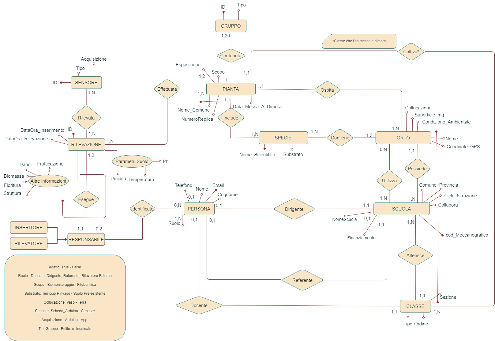
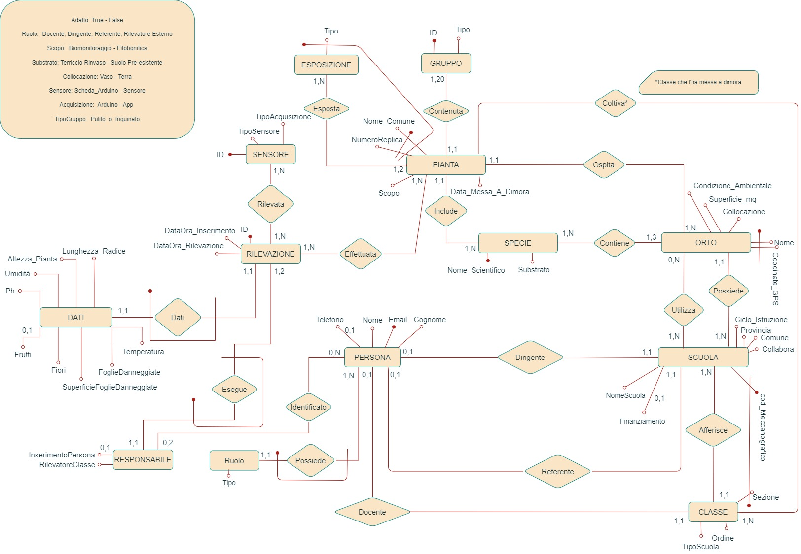

# Progetto di Base Dati 2023 - "Orti Scolastici" - 12 CFU

## Componenti del Gruppo

- Andrea Franceschetti - 4357070
- William Chen -
- Alessio De Vincenzi - 4878315

## Parte 1 - Requisiti e Progettazione Concettuale

### 1 - Descrizione del dominio applicativo

### 1.1 - Leggenda

<ul>
  <li> Verde  - Entità </li>
  <li> Giallo  - Attributo </li>
  <li> Blu  - Attibuti composti </li>
  <li> Viola  - Relazione </li>
  <li> Arancione  - Vincoli </li>
  <li> Rosso  - Note di disambiguazione </li>
</ul>

### 1.2 - Descrizione del dominio applicativo

Si vuole realizzare una base di dati a supporto dell’iniziativa di citizen science rivolta alle scuole “Dalla botanica ai big data” (che rappresenta l'intero scherma ER).

L’iniziativa mira a costruire una rete di supporto per le scuole che partecipano a progetti (gli attributi verrano specificati sucessivamente) relativi agli orti scolastici. Per ogni scuola si vogliono memorizzare il nome dell’istituto scolastico, il codice meccanografico, la provincia, il ciclo di istruzione (primo o secondo ciclo di istruzione) e se l’istituto beneficia o meno di un finanziamento (attributo dell'entità Progetti) per partecipare all’iniziativa (relazione tra Scuola e Progetto), in tal caso ne memorizziamo il tipo (attributo dell'entità Progetti).

Per ogni scuola c’è almeno una persona di riferimento (relazione tra Progetto e Persona) per l’iniziativa, ma possono essercene diverse (molteplicità sulla relazione precedente). Per ogni persona coinvolta vogliamo memorizzare nome, cognome, indirizzo di email, opzionalmente (molteplicità sull'attributo) un contatto telefonico e il ruolo (dirigente, animatore digitale, docente, ...). Nel caso la scuola sia titolare di finanziamento per partecipare all’iniziativa (es. finanziamento per progetto PON EduGreen) si vuole memorizzare se la persona sia il referente (relazione tra Pesona e Progetto) e un partecipante  (relazione tra Persona e Scuola) al progetto da cui deriva il finanziamento. All’interno della scuola, possono esserci più classi partecipanti all’iniziativa. Per ognuna di esse si vuole memorizzare la classe (es. 4E) (indicato come Nome), l’ordine (es. primaria, secondaria di primo grado) o il tipo di scuola (es. liceo scienze applicate, agrario) e il docente di riferimento per la partecipazione (relazione tra Persona e Classe) di tale classe.

Ogni scuola ha (relazione tra Scuola e Orto) uno o più (molteplicità sulla relazione precedente) orti, identificati da un nome che identifica l’orto all’interno della scuola. Ogni orto può essere in pieno campo o in vaso (indicati come attributo 'Collocazione'), ed è caratterizzato da coordinate GPS e una superficie in mq. Si vuole inoltre memorizzare se le condizioni ambientali dell’orto lo rendono adatto a fare da controllo per altri istituti (cioè se si trova in un contesto ambientale "pulito" e l’istituto è disposto a collaborare (attributo di Scuola indicato come 'Collabora') con altri).

Le piante vengono piantate con scopi di biomonitoraggio o fitobonifica. Con biomonitoraggio si intende il monitoraggio dell'inquinamento mediante organismi viventi. Le principali tecniche di biomonitoraggio consistono nell'uso di organismi bioaccumulatori per fornire informazioni sulla situazione ambientale. Fornisce stime sugli effetti combinati di più inquinanti sugli esseri viventi, ha costi di gestione limitati e consente di coprire vaste zone e territori diversificati, consentendo una adeguata mappatura del territorio. Con fitobonifica si intende l’utilizzo delle piante per disinquinare aria, acqua, sedimenti e suoli.

Si considerano un certo numero di specie per i diversi scopi e per ogni specie vengono utilizzate (relazione tra Specie e Pianta) un certo numero di repliche (indicata come entità 'Pianta') (cioè esemplari veri e propri delle piante). In particolare, in caso di biomonitoraggio le repliche del gruppo di controllo (indicato come attributo  'Tipo') (“nel pulito”) dovranno essere lo stesso numero di quelle del gruppo per cui vogliamo monitorare lo stress ambientale. Le repliche di controllo potranno essere dislocate in un orto a disposizione dello stesso istituto o in un orto messo a disposizione da altro istituto e andrà mantenuto il collegamento tra gruppo per cui si monitora lo stress ambientale e il corrispondente gruppo di controllo. In particolare, ogni scuola dovrebbe concentrarsi (relazione tra Orto e Specie) su tre specie (indicato come molteplicità sulla relazione precedente) e ogni gruppo dovrebbe contenere (relazione tra Gruppo e Pianta) 20 repliche.

Per ogni specifica pianta (stessa entità di relazione, indicata come 'Pianta') messa a dimora, verrà memorizzata la specie (indicato dalla relazione tra Specie e Pianta), il numero di replica (indicato come ID), il gruppo (indicato dalla relazione tra Gruppo e Pianta), l’orto (indicato dalla relazione tra Orto e Pianta), l’esposizione specifica, la data di messa a dimora e la classe (indicato dalla relazione tra Classe e Pianta) che l’ha messa a dimora.

Le rilevazioni (osservazioni) vengono effettuate (relazione tra Pianta e Rilevazione) sulle specifiche piante (repliche) e le informazioni acquisite memorizzate con data e ora della rilevazione, data e ora dell’inserimento, responsabile della rilevazione (indicato dalla relazione tra Rilevazione e Perosna) (può essere un individuo o una classe) e responsabile dell’inserimento (se diverso da quello della rilevazione e anche in questo caso può essere un individuo o una classe).

Le informazioni ambientali relative a pH, umidità e temperatura vengono acquisite mediante sensori o schede Arduino (indicati come unica entità 'Sensore'), si vogliono memorizzare numero e tipo di sensori presenti in ogni orto (e le repliche associate a quel sensore). Le informazioni possono essere rilevate tramite app e inserite nella base di dati oppure essere trasmesse direttamente da schede Arduino alla base di dati. Si vuole tenere traccia della modalità di acquisizione delle informazioni.

## 2 - Progettazione Concettuale

### 2.1 - Diagramma ER

### 2.2 - Domini e Entità

| #  | ENTITA'     | DESCRIZIONE                               | ATTRIBUTI             | DESCRIZIONE                                                                             | DOMINIO                                                |
| :- | :---------- | :---------------------------------------- | :-------------------- | :-------------------------------------------------------------------------------------- | :----------------------------------------------------- |
| 1  | Progetto    | A cui la scuola partecipa                 | ID                    | Chiave primaria; Identificativo                                                    | BIGINT                                                 |
|    |             |                                           | Finanziamento         | Tipo di finanziamento se la Scuola ne beneficia                                         | TEXT                                                   |
|    |             |                                           | Nome                  | Indica il nome                                                                          | TEXT                                                   |
| 2  | Scuola      | Indentifica la scuola                     | cod_Meccanografico    | Chiave primaria; Identifica il codice meccanografico della scuola                  | VARCHAR(10)                                            |
|    |             |                                           | Nome                  | Indica il nome della scuola                                                             | TEXT                                                   |
|    |             |                                           | Ciclo_Istruzione      | La scuola è del primo ciclo d’istruzione o il secondo                                 | Primo, Secondo                                         |
|    |             |                                           | Collabora             | La scuola collabora con altre (True) o no (False)                                       | BOOLEAN                                                |
|    |             |                                           | Provincia             | Sigla della provincia di appartenza                                                     | CHAR(2)                                                |
|    |             |                                           | Comune                | Comune dov'è la scuola                                                                 | TEXT                                                   |
| 3  | Classe      | Indica le classi che aderiscono           | Sezione               | Chiave primaria; Nome della classe es. 4E,4ART,4E-I                                | VARCHAR(5)                                             |
|    |             |                                           | Ordine                | Ordine della classe (primo, secondo); Opzionale                                         | 1, 2                                                   |
|    |             |                                           | Tipo                  | Scientifico, Classico, Agrario, ...                                                     | TEXT                                                   |
| 4  | Persona     | Coloro che partecipano                    | Email                 | Chiave primaria;  Email della persona.                                             | TEXT                                                   |
|    |             |                                           | Nome                  | Nome della persona                                                                      | TEXT                                                   |
|    |             |                                           | Cognome               | Cognome della persona                                                                   | TEXT                                                   |
|    |             |                                           | Ruolo                 | Ruolo della persona                                                                     | Dirigente, Docente, Referente, Rilevatore Esterno      |
|    |             |                                           | Telefono              | Numero di telefono; Opzionale                                                           | NUMERIC(10)                                            |
| 5  | Orto        | Orti delle scuole partecipanti            | Nome                  | Chiave primaria; Nome dell'orto                                                    | TEXT                                                   |
|    |             |                                           | Coordinate_GPS        | Chiave primaria; Coordinate GPS dell'orto (Latitudine, Longitudine)                | FLOAT, FLOAT                                           |
|    |             |                                           | Condizione_Ambientale | Condizioni ambientali dell'orto (Pulito, Inquinato)                                     | Pulito, Inquinato                                      |
|    |             |                                           | Collocazione          | L'orto è in terra o in vaso.                                                           | Vaso, Terra                                            |
|    |             |                                           | Superficie_mq         | Superficie in metri quadrati                                                            | FLOAT                                                  |
| 6  | Specie      | Specie della pianta coltivata             | Nome_Scientifico      | Chiave primaria; Nome della famiglia della pianta                                  | TEXT                                                   |
|    |             |                                           | Substrato             | Tipo di terra in cui è coltivata la specie, terriccio da rinvaso o suolo pre-esistente | Terriccio_Rinvaso, Suolo_Pre-Esistente                 |
| 7  | Pianta      | Piante che vengono coltivate              | Nome_Comune           | Nome comune della pianta                                                                | TEXT                                                   |
|    |             |                                           | Scopo                 | Chiave Primaria; Scopo della specie, Fitobonifica o Biomonitoraggio.               | Fitobonifica, Biomonitoraggio                          |
|    |             |                                           | Data_Messa_A_Dimora   | Data in cui è stata piantata una replica                                               | DATE                                                   |
|    |             |                                           | Esposizione           | Esposizione della replica                                                               | Sole, Mezz’ombra, Ombra                               |
|    |             |                                           | Numero_Replica        | Chiave Primaria; Identificativo della replica della pianta                         | BIGINT                                                 |
| 8  | Gruppo      | Gruppo di piante per un determinato scopo | ID                    | Chiave primaria; Identificatore del gruppo                                         | BIGINT                                                 |
|    |             |                                           | Tipo                  | Il gruppo è Pulito o Inquinato                                                         | Controllo, Stress_Ambientale                           |
| 9  | Rilevazione | Elenco dei dati registrati dai sensori    | ID                    | Chiave primaria; Identificatore della rilevazione                                  | BIGINT                                                 |
|    |             |                                           | DataOra_Rilevazione   | Data e Ora in cui viene eseguita la rilevazione                                         | TIMESTAMP                                              |
|    |             |                                           | DataOra_Inserimento   | Data e Ora in cui viene eseguito l'inserimento nella base di dati                       | TIMESTAMP                                              |
|    |             |                                           | Parametri del suolo   | Attributo composto; Informazioni riguardanti il suolo                              | Temperatura, PH, Umidità                              |
|    |             |                                           | Altre Informazioni    | Attributo composto; Altre informazioni riguardanti le piante                       | Danni, Fioritura, Biomassa, Dtruttura, Fruttificazione |
| 10 | Rilevatore  | Responsabile della rilevazione            | ID_Rilevazione        | Chiave primaria; ID della rilevazione di riferimento                               | BIGINT                                                 |
| 11 | Sensore     | Sensori per le rilevazioni                | ID                    | Chiave primaria; Identificatore univoco                                            | BIGINT                                                 |
|    |             |                                           | Tipo                  | Tipo del sensore: SchedaArduino o Sensore                                               | SchedaArduino, Sensore                                 |
|    |             |                                           | Acquisizione          | Tipo di acquisizione delle informazioni                                                 | Arduino, App                                           |

### 2.3 - Associazioni

| #  | ASSOCIAZIONE  | DESCRIZIONE                                                 | ENTITA'                 | MOLTEPLICITA' |
| :- | :------------ | :---------------------------------------------------------- | :---------------------- | :-----------: |
| 1  | Rappresentata | La classe è rappresentata da un docente                    | Classe, Persona         |   1:1 - 0:1   |
| 2  | Coltiva       | La classe coltiva delle piante                              | Classe, Pianta          |   1:N - 1:1   |
| 3  | Afferisce     | La classe fa parte di una scuola                            | Classe, Scuola          |   1:1 - 1:N   |
| 4  | Appartiene    | Persone lavorano e/o appartengono alla scuola               | Persona, Scuola         |   0:1 - 1:N   |
| 5  | Iscritta      | La scuola è iscritta a uno o più progetti                 | Scuola, Progetto        |   1:N - 1:N   |
| 6  | Utilizza      | La scuola utilizza un orto di un’altra scuola              | Scuola, Orto            |   1:N - 0:N   |
| 7  | Possiede      | La scuola possiede un orto                                  | Scuola, Orto            |   1:N - 1,1   |
| 8  | Partecipa     | Una persona partecipa al progetto, con un determinato ruolo | Persona, Progetto       |   0:N - 1:N   |
| 9  | Responsabile  | Una persona è responsabile della rilevazione               | Persona, Rilevazione    |   0:N - 1:2   |
| 10 | Contiene      | Nell’orto sono contenute diverse specie di piante          | Orto, Specie            |   1:3 - 1:N   |
| 11 | Ospitate      | Nell’orto sono messe a dimora delle piante                 | Orto, Pianta            |   1:N - 1:1   |
| 12 | Include       | Una specie include diversi piante                           | Specie, Pianta          |   1:N - 1:1   |
| 13 | Contenuta     | Le piante sono contenute in al massimo 2 diversi gruppi     | Pianta, Gruppo          |  1:1 - 1:20  |
| 14 | Effettuata    | Sulle piante/repliche sono effettuate delle rilevazioni     | Pianta, Rilevazione     |   1:N - 1:N   |
| 15 | Rilevata      | I sensiori fanno le rilevazioni dei dati                    | Sensore, Rilevazione    |   1:N - 1:N   |
| 16 | Identificato  | La persona fa Rileva o Inserisce i dati                     | Persona, Responsabile   |   0:N - 0:2   |
| 17 | Esegue        | Rilevatore esegue la rilevazione                            | Rilevatore, Rilevazione |   1:1 - 1:2   |

### 2.4 - Vincoli

| # | ENTITÀ     | VINCOLO                                                                                                                                             | TIPO SQL  |
| :- | :---------- | :-------------------------------------------------------------------------------------------------------------------------------------------------- | :-------- |
| 1 | Progetto    | Se la scuola riceve un finanziamento per un progetto, si memorizzerà una Persona con ruolo "Referente"                                             | [TRIGGER] |
| 2 | Orto        | Se l'orto della scuola ha come Condizione Ambientale "Pulito", allora può essere adatto per fare da controllo per orti di altre scuole             | [CHECK]   |
| 3 | Scuola      | Se la scuola utilizza un orto con Condizione Ambientale "Pulito", allora può essere collaborare con altre scuole                                   | [CHECK]   |
| 4 | Pianta      | Se lo Scopo è "Biomonitoraggio" allora il Numero di Repliche del Gruppo di Controllo devono essere uguali a quelle del Gruppo di Monitoraggio      | [CHECK]   |
| 5 | Rilevamento | Se il responsabile dell'Inserimento è diverso da quello della Rilevazione allora dobbiamo inserire due Persone o Classi per la stessa rilevazione. | [TRIGGER] |

### 2.5 - Generalizzazioni

Esite una generalizzazione per l'entità Responsabile, che può essere Responsabile di Rilevazione o Responsabile di Inserimento.

## 3 - Progettazione Logica

### 3.1 - Schema Relazionale Ristrutturato

### 3.2 - Modifiche ad Entità, Associazioni e Vincoli

Nella Ristrutturazione del modello ER sono state apportate le seguenti modifiche:

- L'attributo multiplo "Ruolo" dell'entità Persona è stato sostituito con l'entità Ruolo, in modo da evitare la ripetizione di valori, ed è stato aggiunto l'attributo "Tipo" per descrivere meglio il tipo ruolo.
- Gli atributi multipli "Parametri del suolo" e "Altre Informazioni" sono stati sostituiti dall'entità "Dati" e nuovi attributi più espicativi:

  - ID
  - Temperatura
  - PH
  - Umidità
  - N_Foglie_Danneggiate
  - %_Superficie_Foglie_Danneggiate
  - N_Frutti
  - N_Fiori
  - Altezza_Pianta
  - Lunghezza_Radice
- L'attributo multiplo "Esposizione" dell'entità Pianta è stato sostituito con entità singola con attributo composto Nome_Comune, Numero_Replica (derivato da Pianta, ed è chiave) e l'attributo Tipo (Sole, Mezzombra, Ombra).

### 3.3 - Modifiche ai Vincoli

Non sto state effettuate modifiche ai vincoli precedenti.

### 3.4 - Modifiche alle generalizzazioni

La generalizzazione per l'entità Responsabile è stata riorganizzata aggiungendo due attibruti alla stessa entità.

### 3.5 - Schema Logico

<ol type="1" style="text-align: left;">
  <li> Progetto (<u>ID</u>, FinanziamentoO, Nome) </li>
  <li> Persona (<u>Email</u>, Nome, Cognome, TelefonoO, RilevatoreEsternoO)</li>  
  <li> Scuola (<u>cod_Meccanografico</u>, Nome, Ciclo_istruzione, Comune, Provincia, CollaboraO, DirigentePersona) </li>
  <li> Aderisce (<u>Scuola</u>Scuola, <u>Progetto</u>Progetto, ReferentePersona)</li>
   
  <li> Classe (<u>ID</u>, <i>Sezione</i>, <i>Scuola</i><i>Scuola</i>, Ordine, TipoScuola, DocentePersona)</li>
  <li> Studente (<u>Alunno</u>Persona, ClasseClasse)</li>
   
  <li> Specie (<u>Nome_Scientifico</u>, Substrato)</li>
  <li> Orto (<u>Nome</u>, <u>Latitudine</u>, <u>Longitudine</u>, Superficie_mq, Posizione, CondizioneAmbientale, ScuolaScuola, SpecieSpecie)</li>
  <li> Pianta (<u>NumeroReplica</u>, <u>NomeComune</u>, DataMessaADimora, Scopo, SpecieSpecie, ClasseClasse)</li>
  <li> Gruppo (<u>ID</u>, Tipo, PiantaPianta, NumeroReplicaPianta)</li>
  <li> Esposizione (PiantaPianta, NumeroReplicaPianta, Tipo)</li>
   
  <li> Rilevazione (<u>ID</u>, DataOra_Inserimento, DataOra_Rilevazione, PiantaPianta, NumeroReplicaPianta)</li>
  <li> Sensore (<u>ID</u>, Tipo, Acquisizione, ID_RilevazioneRilevazione)</li>
  <li> Dati (<u>ID</u>Rilevazione, Temperatura, PH, Umidità, N_Foglie_Danneggiate, %_Superficie_Foglie_Danneggiate, N_FruttiO, N_Fiori, Altezza_Pianta, Lunghezza_Radice)</li>
  <li> Responsabile (<u>ID</u>Rilevazione, InserimentoOPersona, RilevatorePersona, InserimentoOClasse, RilevatoreClasse)</li>
</ol>

### 3.6 - Verifica della correttezza e della qualità dello schema logico e del modello ER ristrutturato

<b>Progetto (<u>ID</u>, FinanziamentoO , Nome)</b> 
ID -> Finanziamento, Nome; 
La relazione è <b>BCNF</b> dato che la chiave è unica e compare a sinistra. 
 
<b>Scuola (<u>cod_Meccanografico</u>, NomeScuola, Ciclo_istruzione, CollaboraO, Provincia, Comune, ProgettoProgetto)</b> 
cod_Meccanografico -> NomeScuola, Ciclo_istruzione;  
...  
cod_Meccanografico -> NomeScuola, Ciclo_istruzione, CollaboraO, Provincia, Comune, ProgettoProgetto; 
La relazione è <b>BCNF</b>, l'unica chiave possibile è chiave primaria della Relazione. 
 
<b>Persona (<u>Email</u>, TelefonoO, Nome, Cognome)</b> 
Email -> Nome, Cognome, Telefono; 
La relazione è <b>BCNF</b>, l'unica chiave possibile è chiave primaria della Relazione. 
 
<b>Ruolo (<u>Email</u>Persona,Tipo)</b> 
Email -> Tipo; 
La relazione è <b>BCNF</b>, l'unica chiave possibile è chiave primaria della Relazione. 
 
<b>Classe (<u>Sezione</u>, <u>cod_Meccanografico</u>Scuola, Ordine, TipoScuola, DocentePersona)</b> 
Sezione, cod_Meccanografico -> Ordine, TipoScuola; 
... 
Sezione, cod_Meccanografico -> Ordine, TipoScuola, DocentePersona; 
La relazione è <b>BCNF</b>, dato che la chiave compare a sinistra. 
 
<b>Specie (<u>Nome_Scientifico</u>, Substrato)</b> 
Nome_Scientifico -> Substrato; 
La relazione è <b>BCNF</b>, l'unica chiave possibile è chiave primaria della Relazione. 
 
<b>Orto (<u>Nome</u>, <u>Coordinate_GPS</u>, Superficie_mq, Posizione, Condinzione_Ambientale, ScuolaScuola, SpecieSpecie)</b> 
Nome, Coordinate_GPS -> Superficie_mq, Posizione; 
... 
Nome, Coordinate_GPS -> Superficie_mq, Posizione, Condinzione_Ambientale, ScuolaScuola, SpecieSpecie; 
La relazione è <b>BCNF</b>, dato che la chiave compare a sinistra. 
 
<b>Pianta (<u>Numero_Replica</u>, <u>Nome_Comune</u>, Data_Messa_A_Dimora, Scopo, SpecieSpecie, ClasseClasse, ScuolaClasse)</b> 
Numero_Replica, Nome_Comune -> Data_Messa_A_Dimora, Scopo, Specie, Classe, Scuola; 
La relazione è <b>BCNF</b>, l'unica chiave possibile è chiave primaria della Relazione. 
 
<b>Gruppo (<u>ID</u>, Tipo, PiantaPianta, NumeroReplicaPianta)</b> 
ID -> Tipo, Pianta, NumeroReplica; 
La relazione è <b>BCNF</b>, l'unica chiave possibile è chiave primaria della Relazione. 
 
<b>Esposizione (PiantaPianta, NumeroReplicaPianta, Tipo)</b> 
Pianta, NumeroReplica -> Tipo; 
La relazione è <b>BCNF</b>, dato che la chiave compare a sinistra. 
 
<b>Rilevazione (<u>ID</u>, DataOra_Inserimento, DataOra_Rilevazione, PiantaPianta, NumeroReplicaPianta)</b> 
ID -> DataOra_Inserimento, DataOra_Rilevazione; 
... 
ID -> DataOra_Inserimento, DataOra_Rilevazione, Pianta, NumeroReplica; 
La relazione è <b>BCNF</b>, dato che la chiave compare a sinistra. 
 
<b>Sensore (<u>ID</u>, Tipo, Acquisizione, ID_RilevazioneRilevazione)</b> 
ID -> Tipo, Acquisizione, ID_Rilevazione; 
La relazione è <b>BCNF</b>, l'unica chiave possibile è chiave primaria della Relazione. 
 
<b>Dati (<u>ID</u>Rilevazione, Temperatura, PH, Umidità, N_Foglie_Danneggiate, %_Superficie_Foglie_Danneggiate, N_FruttiO, N_Fiori, Altezza_Pianta, Lunghezza_Radice)</b> 
ID -> Temperatura, PH, Umidità; 
... 
ID -> Temperatura, PH, Umidità, N_Foglie_Danneggiate, %_Superficie_Foglie_Danneggiate, N_Frutti, N_Fiori, Altezza_Pianta, Lunghezza_Radice; 
La relazione è <b>BCNF</b>, dato che la chiave compare a sinistra. 
 
<b>Responsabile (<u>ID</u>Rilevazione, InserimentoOPersona, RilevatorePersona)</b> 
ID -> Inserimento, Rilevatore; 
La relazione è <b>BCNF</b>, dato che la chiave compare a sinistra. 
 
<b>Tutte le relazioni sono in forma normale di Boyce-Codd, e tutte sono in terza forma normale.</b>

